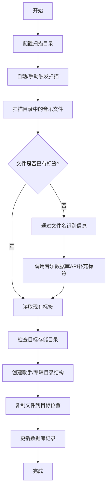
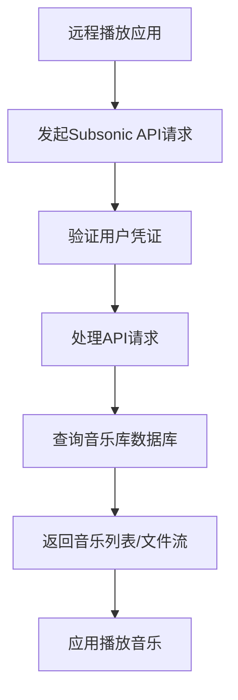

# 音乐整理 - 产品需求文档

---

## 1. 产品概述

**Music Organize** 是一个音乐文件自动化管理系统，核心功能包括：从下载目录扫描音乐文件、自动识别并填充音乐标签（Tag）信息、将文件整理到结构化的存储目录中，并提供 Subsonic API 兼容接口以支持远程播放应用访问。同时提供网页管理界面，方便用户进行配置和管理。

**目标用户**: 音乐收藏爱好者，需要系统化管理本地音乐库，并希望通过手机/平板等远程设备访问音乐。

**解决的问题**:
- 手动整理音乐文件耗时费力
- 下载的音乐文件缺少完整的元数据（歌名、专辑、歌手等）
- 文件分散在多个目录，难以管理
- 无法方便地通过远程设备访问本地音乐

---

## 2. 核心功能

### 2.1 用户角色

| 角色 | 注册方式 | 核心权限 |
|------|----------|----------|
| 管理员 | 本地设置（无需注册） | 完整系统管理权限 |

### 2.2 功能模块

1. **文件扫描模块**: 扫描指定目录（如下载文件夹）中的音乐文件
2. **刮削模块**: 自动识别音乐文件信息、专辑封面、歌词，填充缺失的标签
3. **文件整理模块**: 将音乐文件按照指定结构组织存储，支持灵活配置目录命名字段和多艺术家处理
4. **Subsonic API**: 提供兼容 Subsonic 的 API 接口，支持远程播放应用
5. **后台任务管理模块**: 管理和监控系统后台任务（扫描、整理、更新等）
6. **网页管理界面**: 提供配置、监控和管理功能

### 2.3 页面详情

| 页面名称 | 模块名称 | 功能描述 |
|----------|----------|----------|
| 仪表盘 | 首页仪表盘 | 显示音乐库概览、扫描状态、最近更新、系统状态 |
| 扫描管理 | 扫描管理 | 配置扫描目录、手动触发扫描、查看扫描日志 |
| 任务管理 | 任务管理 | 查看后台任务列表、任务状态、任务日志、手动终止任务 |
| 音乐库 | 音乐库 | 浏览音乐列表、查看详情、搜索过滤 |
| 设置 | 系统设置 | 配置存储路径、文件整理规则、刮削选项 |
| 设置 | Subsonic 配置 | 配置 Subsonic 服务端口、认证、API 权限 |
| 播放列表 | 播放列表 | 创建和管理自定义播放列表 |

---

## 3. 核心流程

### 3.1 文件扫描与整理流程

### 3.2 远程访问流程

---

## 4. 用户界面设计

### 4.1 设计风格

- **主色调**: 深蓝色 (#1a1a2e) 配合紫色点缀 (#4a1942)
- **按钮样式**: 圆角矩形，悬停时有渐变效果
- **字体**: 无衬线字体（如 Inter），清晰可读
- **布局风格**: 侧边栏导航 + 主内容区，卡片式布局
- **图标风格**: 现代简约的线性图标

### 4.2 页面设计概览

| 页面名称 | 模块名称 | UI 元素 |
|----------|----------|---------|
| 仪表盘 | 统计卡片 | 音乐总数、歌手数、专辑数、最近添加 |
| 仪表盘 | 扫描状态 | 上次扫描时间、扫描进度条、触发扫描按钮 |
| 仪表盘 | 最近更新 | 最近添加的音乐列表（封面、标题、歌手） |
| 扫描管理 | 目录配置 | 目录列表、添加/删除目录按钮 |
| 扫描管理 | 扫描日志 | 时间线样式的日志列表，显示状态和结果 |
| 音乐库 | 音乐列表 | 网格/列表视图切换、搜索框、筛选器 |
| 音乐库 | 音乐详情 | 封面大图、标签信息、播放控制 |
| 设置 | 存储配置 | 目标路径输入、目录结构模板选择 |
| 设置 | 文件整理规则 | 整理方式选择（复制/移动/修改）、目录命名字段选择、文件名模板配置、艺术家处理方式、分隔符配置、预览效果 |
| 设置 | Subsonic | 启用开关、端口设置、用户认证配置 |
| 设置 | Subsonic 高级配置 | API 版本设置、最大并发连接数、流媒体格式设置 |
| 任务管理 | 任务列表 | 任务ID、任务类型、状态、进度、开始时间、结束时间 |
| 任务管理 | 任务详情 | 任务日志、执行结果、错误信息 |
| 播放列表 | 列表管理 | 播放列表列表、创建/编辑/删除操作 |

### 4.3 响应式设计

- **桌面端**: 完整侧边栏 + 主内容区布局
- **平板端**: 侧边栏可折叠，响应式网格
- **移动端**: 底部导航栏，简化布局

---

## 5. 功能需求

### 5.1 文件扫描

| 需求编号 | 描述 | 优先级 |
|----------|------|--------|
| FR-001 | 支持配置多个扫描目录（如下载文件夹） | 高 |
| FR-002 | 支持自动扫描（定时任务）和手动触发 | 高 |
| FR-003 | 支持常见音乐格式：MP3, FLAC, WAV, AAC, OGG | 高 |
| FR-004 | 跳过已处理过的文件（通过文件哈希判断） | 中 |
| FR-005 | 显示扫描进度和状态 | 中 |

### 5.2 刮削与标签填充

| 需求编号 | 描述 | 优先级 |
|----------|------|--------|
| FR-006 | 读取现有 ID3/WMA 标签信息 | 高 |
| FR-007 | 从文件名自动解析：歌手 - 歌名 | 高 |
| FR-008 | 通过在线音乐数据库（如 MusicBrainz）补充缺失标签 | 高 |
| FR-009 | 下载专辑封面图片并保存到本地 | 高 |
| FR-009-A | 支持配置专辑封面存储位置（内嵌到文件或独立文件） | 中 |
| FR-010 | 刮削并下载歌词信息 | 高 |
| FR-010-A | 支持配置歌词存储格式（内嵌到文件或独立 .lrc 文件） | 中 |
| FR-011 | 支持手动编辑标签信息 | 中 |
| FR-011-A | 自动将繁体中文标签转换为简体中文后再写入 | 高 |
| FR-011-B | 支持配置是否启用繁简转换功能 | 中 |
| FR-011-C | 默认启用繁简转换功能 | 中 |

### 5.3 文件整理

| 需求编号 | 描述 | 优先级 |
|----------|------|--------|
| FR-012 | 支持自定义目录结构模板 | 高 |
| FR-013 | 默认结构：歌手/专辑/歌曲.ext | 高 |
| FR-014 | 支持文件重命名，提供自定义文件名命名规则设置 | 高 |
| FR-014-A | 支持配置文件名模板（可使用标签字段变量） | 高 |
| FR-014-B | 支持的文件名变量：{trackNumber}、{title}、{artist}、{album}、{year}、{discNumber} | 高 |
| FR-014-C | 默认文件名模板：{trackNumber} - {title} | 中 |
| FR-014-D | 支持预览文件名效果 | 中 |
| FR-015 | 支持三种文件整理方式选择 | 高 |
| FR-015-A | 复制模式：从源位置复制文件到目标位置，保留源文件 | 高 |
| FR-015-B | 移动模式：将源文件移动到目标位置，删除源文件 | 高 |
| FR-015-C | 修改模式：直接在源文件位置重命名文件和调整目录结构 | 高 |
| FR-015-D | 默认整理方式为移动模式 | 中 |
| FR-016 | 处理重复文件（跳过/替换/重命名） | 中 |
| FR-016-A | 支持配置每级目录命名使用的字段（艺术家、专辑、年份、流派等） | 高 |
| FR-016-B | 支持配置文件名使用的字段（标题、音轨号、艺术家等） | 高 |
| FR-016-C | 艺术家字段支持选择使用主要艺术家名称（主要艺术家定义：歌曲所在专辑的艺术家名称） | 高 |
| FR-016-D | 艺术家字段支持选择使用所有艺术家名称 | 高 |
| FR-016-E | 支持配置多名艺术家之间的分隔符（如「&」、「/」、「,」等） | 高 |
| FR-016-F | 默认分隔符为「&」 | 中 |

### 5.4 Subsonic API 兼容

| 需求编号 | 描述 | 优先级 |
|----------|------|--------|
| FR-017 | 实现 Subsonic API 基础认证 | 高 |
| FR-018 | 实现浏览相关接口（艺术家、专辑、歌曲列表） | 高 |
| FR-019 | 实现流式传输接口（音乐文件流式传输） | 高 |
| FR-020 | 实现搜索接口（搜索音乐） | 中 |
| FR-021 | 实现播放列表接口（播放列表管理） | 中 |

### 5.5 网页管理界面

| 需求编号 | 描述 | 优先级 |
|----------|------|--------|
| FR-022 | 响应式设计，支持多设备 | 高 |
| FR-023 | 音乐库概览统计 | 高 |
| FR-024 | 音乐搜索和过滤 | 高 |
| FR-025 | 扫描任务管理 | 高 |
| FR-026 | 系统配置管理 | 高 |
| FR-027 | 播放列表管理 | 中 |

### 5.6 后台任务管理

| 需求编号 | 描述 | 优先级 |
|----------|------|--------|
| FR-028 | 显示后台任务列表（扫描、整理、更新等） | 高 |
| FR-029 | 显示任务状态（等待中、运行中、完成、失败） | 高 |
| FR-030 | 显示任务进度（百分比） | 高 |
| FR-031 | 显示任务执行时间（开始时间、结束时间、持续时间） | 中 |
| FR-032 | 支持手动终止正在运行的任务 | 高 |
| FR-033 | 查看任务详细日志 | 中 |
| FR-034 | 支持任务历史记录查询 | 中 |
| FR-035 | 任务失败时显示错误信息和重试选项 | 中 |
| FR-036 | 支持任务优先级设置 | 低 |

### 5.7 Subsonic 服务配置

| 需求编号 | 描述 | 优先级 |
|----------|------|--------|
| FR-037 | 支持启用/禁用 Subsonic 服务 | 高 |
| FR-038 | 支持配置 Subsonic 服务端口（默认 4040） | 高 |
| FR-039 | 支持配置管理员用户名和密码 | 高 |
| FR-040 | 支持配置 API 版本（兼容 Subsonic 1.16+） | 中 |
| FR-041 | 支持配置最大并发连接数 | 中 |
| FR-042 | 支持配置流媒体格式（MP3、FLAC、OGG） | 中 |
| FR-043 | 支持配置转码质量 | 中 |
| FR-044 | 支持配置用户权限（只读、读写） | 中 |
| FR-045 | 支持配置访问白名单（IP 限制） | 低 |
| FR-046 | 支持配置 HTTPS（SSL 证书） | 低 |
| FR-047 | 提供 Subsonic 服务状态检查 | 高 |
| FR-048 | 提供 Subsonic API 测试功能 | 中 |

---

## 6. 非功能需求

| 需求编号 | 描述 | 优先级 |
|----------|------|--------|
| NFR-001 | 支持批量处理大量文件（>1000首） | 高 |
| NFR-002 | 扫描过程不影响系统性能 | 中 |
| NFR-003 | 支持后台运行（服务化） | 高 |
| NFR-004 | 数据备份和恢复功能 | 中 |
| NFR-005 | 日志记录和错误追踪 | 中 |

---

## 7. 技术约束

- 支持 Windows/macOS/Linux 操作系统
- 使用 SQLite 作为内置数据库（无需额外安装）
- 低资源占用，适合在 NAS 设备上运行

---

## 8. 术语表

| 术语 | 定义 |
|------|------|
| Tag（标签） | 音乐文件的元数据，包括：标题、艺术家、专辑、年份、流派等 |
| ID3 | MP3 文件的标签标准 |
| Subsonic | 流行的开源音乐流媒体服务器协议 |
| NAS | 网络附加存储设备 |