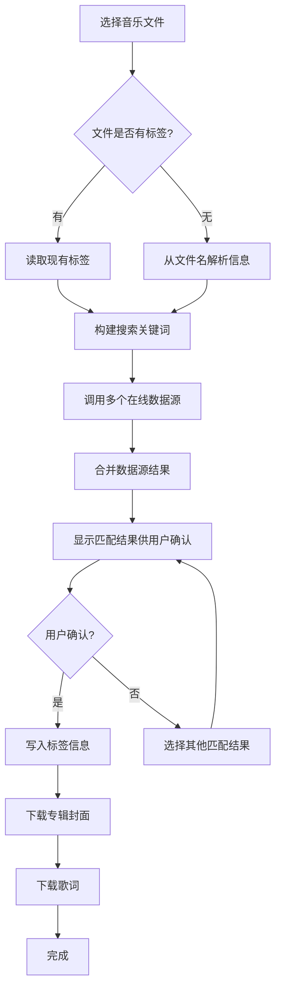
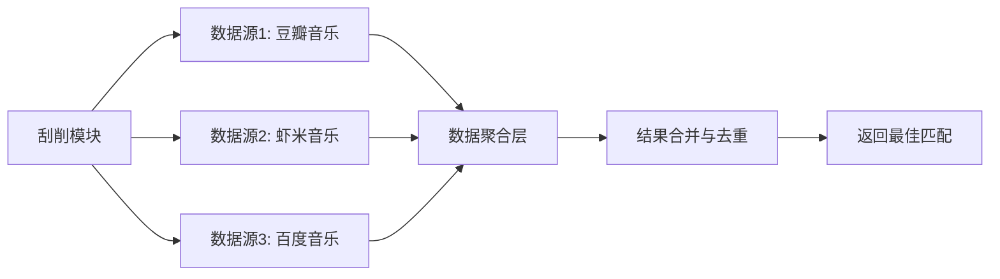

# 参考项目文档 - Music Tag Web 刮削功能分析

---

## 1. 参考项目概述

### 1.1 项目基本信息

| 项目名称 | Music Tag Web |
|----------|--------------|
| 项目类型 | Web 应用（音乐标签管理工具） |
| 技术栈 | 前端 Web 技术（支持浏览器访问） |
| 项目规模 | 中型 |
| 参考目的 | 刮削功能实现参考 |

### 1.2 项目来源

- **项目地址**: https://github.com/xhongc/music-tag-web
- **访问方式**: 公开 GitHub 仓库
- **文档地址**: 项目 README 及相关教程

---

## 2. 刮削功能特性参考

### 2.1 核心刮削功能对比

| 功能模块 | Music Tag Web 实现 | 本项目需求 | 借鉴建议 |
|----------|------------------|-----------|----------|
| 自动刮削 | 支持从在线音乐数据库自动获取标签信息 | 支持自动刮削标签、封面、歌词 | **直接采用** |
| 多数据源支持 | 支持豆瓣、虾米、百度音乐等多个在线服务 | 支持 MusicBrainz 等数据源 | **部分借鉴** |
| 封面抓取 | 支持在线抓取专辑封面并嵌入文件 | 支持下载专辑封面 | **直接采用** |
| 歌词获取 | 支持自动搜索并导入歌词（LRC/TXT格式） | 支持刮削歌词信息 | **直接采用** |
| 批量刮削 | 支持批量选择文件进行一键刮削 | 支持批量处理 | **直接采用** |
| 格式兼容 | 支持 FLAC、MP3、M4A、WAV、OGG、WMA 等多种格式 | 支持常见音乐格式 | **直接采用** |

### 2.2 优秀设计模式

1. **多数据源聚合模式**: 同时对接多个在线音乐数据库，提高信息获取成功率和准确性
2. **批量处理模式**: 支持批量选择文件进行刮削，提高管理效率
3. **标签嵌入模式**: 将获取的标签信息直接嵌入音乐文件元数据，确保数据持久化

---

## 3. 刮削功能流程参考

### 3.1 刮削流程

### 3.2 数据源架构

---

## 4. 刮削功能实现细节

### 4.1 支持的音频格式

Music Tag Web 支持的音频格式包括：
- 无损格式：FLAC、WAV、APE、AIFF、DSF、DFF、WV、TTA、MPC
- 有损格式：MP3、M4A、OGG、WMA、OPUS

### 4.2 标签字段支持

| 标签字段 | 支持情况 | 说明 |
|----------|----------|------|
| 标题 (Title) | ✅ | 从数据源获取 |
| 艺术家 (Artist) | ✅ | 支持多位艺术家 |
| 专辑 (Album) | ✅ | 专辑名称 |
| 年份 (Year) | ✅ | 发行年份 |
| 音轨号 (Track Number) | ✅ | 曲目编号 |
| 流派 (Genre) | ✅ | 音乐流派 |
| 专辑封面 (Cover Art) | ✅ | 在线抓取并嵌入 |
| 歌词 (Lyrics) | ✅ | LRC 格式支持 |

### 4.3 在线数据源

| 数据源 | 主要提供信息 | 稳定性 |
|--------|-------------|--------|
| 豆瓣音乐 | 中文专辑信息、封面 | 中 |
| 虾米音乐 | 歌词、详细标签 | 中 |
| 百度音乐 | 多语言支持 | 高 |

---

## 5. UI/UX 参考

### 5.1 刮削界面设计参考

| 页面/组件 | Music Tag Web 设计特点 | 本项目应用建议 |
|----------|---------------------|---------------|
| 文件选择 | 支持拖拽上传和点击选择 | 采用拖拽上传 |
| 刮削按钮 | 一键刮削按钮，带加载状态 | 采用类似设计 |
| 结果展示 | 显示多个匹配结果供选择 | 采用类似设计 |
| 批量处理 | 复选框选择 + 批量操作 | 采用类似设计 |

### 5.2 交互模式参考

1. **拖拽上传**: 用户可直接拖拽音乐文件到界面进行批量处理
2. **一键刮削**: 简化操作流程，单按钮完成刮削
3. **结果预览**: 刮削前显示匹配结果，用户确认后再写入

---

## 6. 需要避免的问题

根据参考资料，Music Tag Web 的 V1 免费版存在以下限制：
1. **无后台自动刮削**: V1 版不支持后台自动刮削功能
2. **数据源限制**: 部分数据源可能存在访问限制或数据不全
3. **性能问题**: 批量处理大量文件时可能存在性能瓶颈

---

## 7. 本项目借鉴计划

### 7.1 主要借鉴点

- ✅ 多数据源聚合模式
- ✅ 批量刮削功能
- ✅ 封面和歌词同步获取
- ✅ 支持多种音频格式
- ✅ 用户确认机制（刮削前预览）

### 7.2 差异化改进

- 增加 MusicBrainz 数据源支持（更权威的音乐数据库）
- 支持后台自动刮削任务
- 增加繁简中文自动转换
- 支持灵活的目录结构配置

---

## 附录

- **参考项目 GitHub**: https://github.com/xhongc/music-tag-web
- **参考教程**: https://blog.csdn.net/u011342224/article/details/158456608
- **参考版本**: V1 免费版（核心刮削功能）