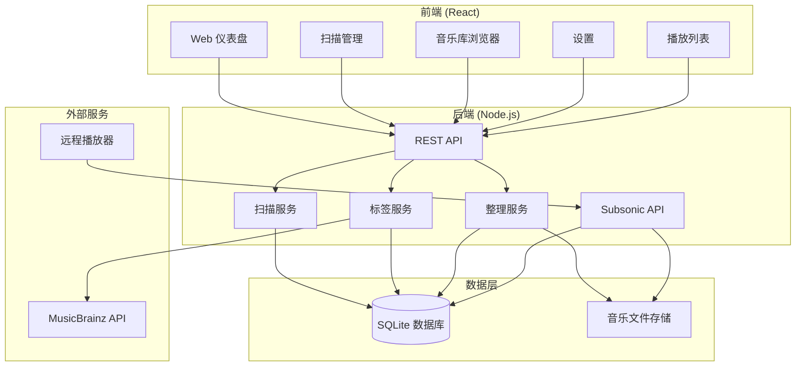
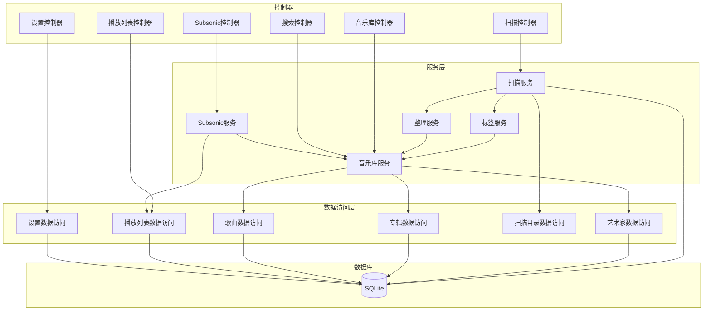
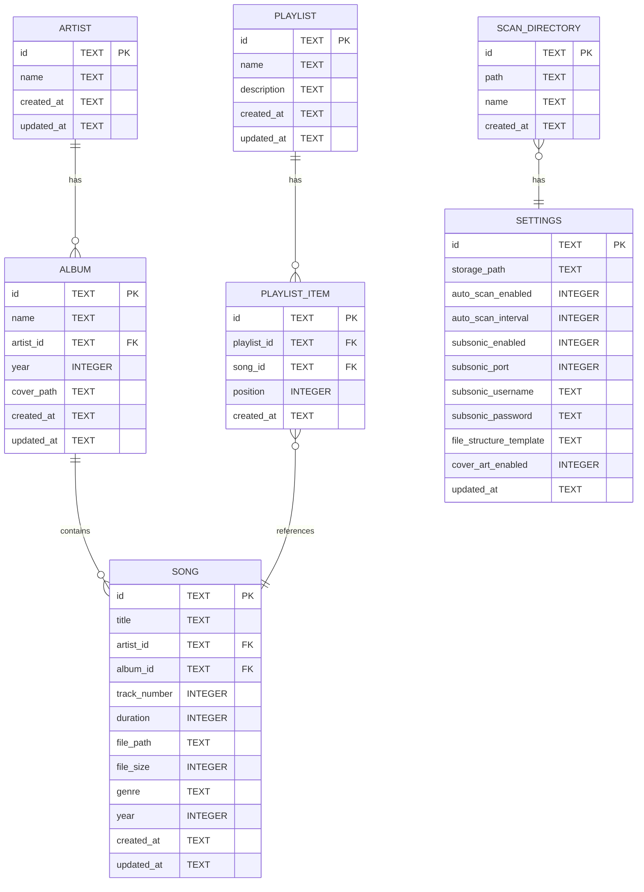

# 音乐整理 - 技术架构文档

---

## 1. 架构设计



---

## 2. 技术描述

| 层次 | 技术 | 版本 | 描述 |
|------|------|------|------|
| 前端 | React | 18+ | Web 管理界面框架 |
| 前端 | TypeScript | 5+ | 类型安全 |
| 前端 | Tailwind CSS | 3+ | 样式框架 |
| 前端 | Vite | 6+ | 构建工具 |
| 后端 | Node.js | 18+ | 服务端运行时 |
| 后端 | Express | 4+ | API 框架 |
| 后端 | TypeScript | 5+ | 类型安全 |
| 数据库 | SQLite | 3+ | 轻量级嵌入式数据库 |
| 文件处理 | music-metadata | 7+ | 音乐标签读取 |
| API | Subsonic API | 1.16+ | 兼容协议版本 |

---

## 3. 路由定义

### 3.1 前端路由

| 路由 | 用途 | 组件 |
|------|------|------|
| `/` | 仪表盘首页 | Dashboard |
| `/scan` | 扫描管理 | ScanManagement |
| `/library` | 音乐库浏览 | Library |
| `/library/artist/:id` | 歌手详情 | ArtistDetail |
| `/library/album/:id` | 专辑详情 | AlbumDetail |
| `/library/song/:id` | 歌曲详情 | SongDetail |
| `/playlists` | 播放列表管理 | Playlists |
| `/settings` | 系统设置 | Settings |

### 3.2 后端 API 路由

| 路由 | 方法 | 用途 |
|------|------|------|
| `/api/scan` | GET | 获取扫描状态 |
| `/api/scan` | POST | 触发扫描任务 |
| `/api/scan/directories` | GET | 获取扫描目录列表 |
| `/api/scan/directories` | POST | 添加扫描目录 |
| `/api/scan/directories/:id` | DELETE | 删除扫描目录 |
| `/api/library/artists` | GET | 获取艺术家列表 |
| `/api/library/artists/:id` | GET | 获取艺术家详情 |
| `/api/library/albums` | GET | 获取专辑列表 |
| `/api/library/albums/:id` | GET | 获取专辑详情 |
| `/api/library/songs` | GET | 获取歌曲列表 |
| `/api/library/songs/:id` | GET | 获取歌曲详情 |
| `/api/library/songs/:id` | PUT | 更新歌曲信息 |
| `/api/search` | GET | 搜索音乐 |
| `/api/playlists` | GET | 获取播放列表 |
| `/api/playlists` | POST | 创建播放列表 |
| `/api/playlists/:id` | PUT | 更新播放列表 |
| `/api/playlists/:id` | DELETE | 删除播放列表 |
| `/api/settings` | GET | 获取系统设置 |
| `/api/settings` | PUT | 更新系统设置 |

### 3.3 Subsonic API 路由

| 路由 | 用途 |
|------|------|
| `/rest/ping.view` | 健康检查 |
| `/rest/getArtists.view` | 获取艺术家列表 |
| `/rest/getArtist.view` | 获取艺术家详情 |
| `/rest/getAlbum.view` | 获取专辑详情 |
| `/rest/getSong.view` | 获取歌曲详情 |
| `/rest/getAlbumList.view` | 获取专辑列表 |
| `/rest/stream.view` | 流式传输音乐 |
| `/rest/search.view` | 搜索 |
| `/rest/getPlaylists.view` | 获取播放列表 |
| `/rest/getPlaylist.view` | 获取播放列表详情 |
| `/rest/createPlaylist.view` | 创建播放列表 |
| `/rest/deletePlaylist.view` | 删除播放列表 |

---

## 4. API 定义

### 4.1 扫描管理 API

#### GET /api/scan
**响应:**
```typescript
interface ScanStatus {
  isRunning: boolean;
  progress: number;
  lastScanTime: string | null;
  scannedCount: number;
  organizedCount: number;
}
```

#### POST /api/scan
**响应:**
```typescript
interface ScanResult {
  success: boolean;
  message: string;
}
```

#### POST /api/scan/directories
**请求:**
```typescript
interface AddDirectoryRequest {
  path: string;
  name: string;
}
```

### 4.2 音乐库 API

#### GET /api/library/artists
**查询参数:**
- `page`: number (默认 0)
- `limit`: number (默认 20)
- `search`: string (可选)

**响应:**
```typescript
interface Artist {
  id: string;
  name: string;
  albumCount: number;
  songCount: number;
  createdAt: string;
}

interface ArtistListResponse {
  data: Artist[];
  total: number;
  page: number;
  limit: number;
}
```

#### GET /api/library/albums/:id
**响应:**
```typescript
interface Album {
  id: string;
  name: string;
  artistId: string;
  artistName: string;
  year: number | null;
  coverPath: string | null;
  songCount: number;
  createdAt: string;
}
```

#### GET /api/library/songs/:id
**响应:**
```typescript
interface Song {
  id: string;
  title: string;
  artistId: string;
  artistName: string;
  albumId: string;
  albumName: string;
  trackNumber: number | null;
  duration: number;
  filePath: string;
  fileSize: number;
  genre: string | null;
  year: number | null;
  createdAt: string;
}
```

### 4.3 搜索 API

#### GET /api/search
**查询参数:**
- `query`: string (必需)
- `type`: 'artist' | 'album' | 'song' | 'all' (默认 'all')
- `limit`: number (默认 20)

**响应:**
```typescript
interface SearchResult {
  artists: Artist[];
  albums: Album[];
  songs: Song[];
}
```

### 4.4 设置 API

#### GET/PUT /api/settings
**响应/请求:**
```typescript
interface Settings {
  storagePath: string;
  scanDirectories: { id: string; path: string; name: string }[];
  autoScanEnabled: boolean;
  autoScanInterval: number; // 分钟
  subsonicEnabled: boolean;
  subsonicPort: number;
  subsonicUsername: string;
  subsonicPassword: string;
  fileStructureTemplate: string; // 如: {artist}/{album}/{title}
  coverArtEnabled: boolean;
}
```

---

## 5. 服务器架构图



---

## 6. 数据模型

### 6.1 ER 图



### 6.2 DDL 语句

```sql
CREATE TABLE IF NOT EXISTS artists (
    id TEXT PRIMARY KEY,
    name TEXT NOT NULL,
    created_at TEXT NOT NULL DEFAULT CURRENT_TIMESTAMP,
    updated_at TEXT NOT NULL DEFAULT CURRENT_TIMESTAMP
);

CREATE TABLE IF NOT EXISTS albums (
    id TEXT PRIMARY KEY,
    name TEXT NOT NULL,
    artist_id TEXT NOT NULL,
    year INTEGER,
    cover_path TEXT,
    created_at TEXT NOT NULL DEFAULT CURRENT_TIMESTAMP,
    updated_at TEXT NOT NULL DEFAULT CURRENT_TIMESTAMP,
    FOREIGN KEY (artist_id) REFERENCES artists(id)
);

CREATE TABLE IF NOT EXISTS songs (
    id TEXT PRIMARY KEY,
    title TEXT NOT NULL,
    artist_id TEXT NOT NULL,
    album_id TEXT NOT NULL,
    track_number INTEGER,
    duration INTEGER,
    file_path TEXT NOT NULL,
    file_size INTEGER NOT NULL,
    genre TEXT,
    year INTEGER,
    created_at TEXT NOT NULL DEFAULT CURRENT_TIMESTAMP,
    updated_at TEXT NOT NULL DEFAULT CURRENT_TIMESTAMP,
    FOREIGN KEY (artist_id) REFERENCES artists(id),
    FOREIGN KEY (album_id) REFERENCES albums(id)
);

CREATE TABLE IF NOT EXISTS playlists (
    id TEXT PRIMARY KEY,
    name TEXT NOT NULL,
    description TEXT,
    created_at TEXT NOT NULL DEFAULT CURRENT_TIMESTAMP,
    updated_at TEXT NOT NULL DEFAULT CURRENT_TIMESTAMP
);

CREATE TABLE IF NOT EXISTS playlist_items (
    id TEXT PRIMARY KEY,
    playlist_id TEXT NOT NULL,
    song_id TEXT NOT NULL,
    position INTEGER NOT NULL,
    created_at TEXT NOT NULL DEFAULT CURRENT_TIMESTAMP,
    FOREIGN KEY (playlist_id) REFERENCES playlists(id),
    FOREIGN KEY (song_id) REFERENCES songs(id)
);

CREATE TABLE IF NOT EXISTS scan_directories (
    id TEXT PRIMARY KEY,
    path TEXT NOT NULL,
    name TEXT NOT NULL,
    created_at TEXT NOT NULL DEFAULT CURRENT_TIMESTAMP
);

CREATE TABLE IF NOT EXISTS settings (
    id TEXT PRIMARY KEY,
    storage_path TEXT NOT NULL,
    auto_scan_enabled INTEGER NOT NULL DEFAULT 1,
    auto_scan_interval INTEGER NOT NULL DEFAULT 60,
    subsonic_enabled INTEGER NOT NULL DEFAULT 1,
    subsonic_port INTEGER NOT NULL DEFAULT 4040,
    subsonic_username TEXT NOT NULL DEFAULT 'admin',
    subsonic_password TEXT NOT NULL DEFAULT 'admin',
    file_structure_template TEXT NOT NULL DEFAULT '{artist}/{album}/{title}',
    cover_art_enabled INTEGER NOT NULL DEFAULT 1,
    updated_at TEXT NOT NULL DEFAULT CURRENT_TIMESTAMP
);

CREATE INDEX IF NOT EXISTS idx_albums_artist_id ON albums(artist_id);
CREATE INDEX IF NOT EXISTS idx_songs_artist_id ON songs(artist_id);
CREATE INDEX IF NOT EXISTS idx_songs_album_id ON songs(album_id);
CREATE INDEX IF NOT EXISTS idx_playlist_items_playlist_id ON playlist_items(playlist_id);
```

---

## 7. 核心服务逻辑

### 7.1 扫描服务

**职责**: 扫描指定目录中的音乐文件

**流程**:
1. 遍历扫描目录
2. 识别音乐文件（根据扩展名）
3. 计算文件哈希，检查是否已处理
4. 调用标签服务解析标签
5. 调用整理服务整理文件
6. 更新数据库记录

### 7.2 标签服务

**职责**: 读取和填充音乐文件标签

**流程**:
1. 使用 music-metadata 读取文件现有标签
2. 如果标签缺失，从文件名解析（格式：歌手 - 歌名）
3. 调用 MusicBrainz API 补充缺失信息
4. 下载专辑封面图片
5. 返回完整标签信息

### 7.3 整理服务

**职责**: 将音乐文件整理到结构化目录

**流程**:
1. 根据标签信息生成目标路径
2. 创建歌手/专辑目录结构
3. 重命名文件（基于标签）
4. 复制或移动文件到目标位置
5. 处理重复文件

### 7.4 Subsonic 服务

**职责**: 实现 Subsonic API 兼容层

**流程**:
1. 解析 Subsonic 请求参数
2. 验证用户凭证
3. 转换请求为内部 API 调用
4. 转换响应为 Subsonic 格式（XML/JSON）
5. 处理流式传输请求

---

## 8. 部署

### 8.1 直接部署

运行以下命令启动应用：

```bash
npm install
npm run build
npm start
```

确保设置以下环境变量：
- `NODE_ENV=production`
- `STORAGE_PATH=/path/to/music`
- `SUBSONIC_PORT=4040`

### 8.2 环境变量

| 变量 | 描述 | 默认值 |
|------|------|--------|
| NODE_ENV | 运行环境 | development |
| PORT | 前端服务端口 | 3000 |
| STORAGE_PATH | 音乐存储路径 | ./music |
| SUBSONIC_PORT | Subsonic 端口 | 4040 |
| DB_PATH | SQLite 数据库路径 | ./data/music.db |

---

## 9. 安全考虑

1. **Subsonic 认证**: 使用 HTTP Basic Auth，密码存储为哈希值
2. **文件访问控制**: 只允许访问音乐存储目录内的文件
3. **路径遍历防护**: 验证用户输入的路径不包含 `..`
4. **CORS 配置**: 限制允许的来源
5. **日志脱敏**: 不记录敏感信息（如密码）